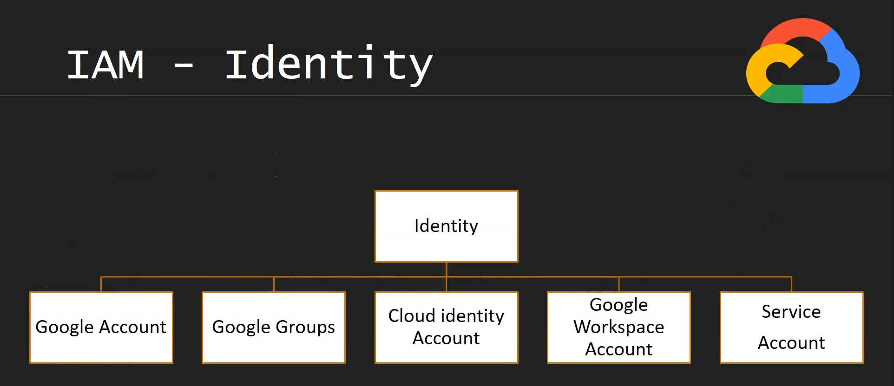

# IAM - Identity & access management

  

  - *who* can do *what* on *which* resources

  - who: identity (user, group , domain, etc)

  - what: action (create, update, delete, etc)

  - which: services (Resources, Compute Engine, App Engine, Cloud Storage)

  - Roles: Collections of permissions (can be built-in roles or custom roles created by you)

## Identity

### Types of identities

  - Google Account
    * a simple google account associated to a @gmail.com email.

  - Google Groups
    * A group of users (use it when you want a group of lets say google accounts have the same privileges)

  - Cloud Identity Account (organization)
    * a role associated with an organization domain (like @random_compay_name)

  - Google Workspace Account (organization)
    * a role associated with an organization domain just like cloud identity account,
      but on google workspace you have acess not only to GCP services but also enterprise
      apps such as Google Drive, Gmail, your video calling app and etc.

  - Service Account
    * role to be used by an application to communicate with another( like a app that communicates with an
      api )
