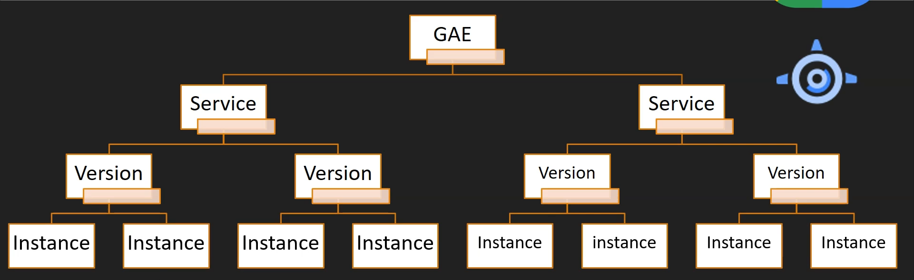

# Deploy application on app engine (Paas)

  

  - fully managed

  - deploy web app at a high scale

  - serverless

  - deploy http based web application

  - runtime supported - GO, Java, .Net, Python, Node.js, PHP ...

  - Two flavors:

      * Standard - Specific Runtime

      * Flexible - Docker Container (supports any runtime)

  - autoscaling

  - Load balancing

  - Versioning

  - Traffic splitting
