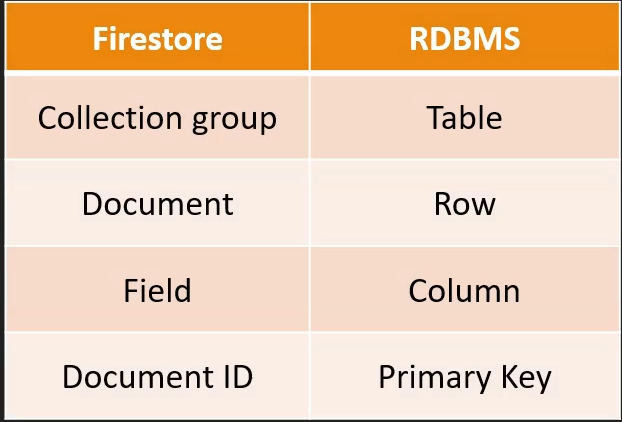

# Cloud Firestore

  - Firestore is the next generation of DataStore

  - highly scalable NoSQL database

  - based on Collection & Document model (collection ~= table, document ~= row)

  - Two modes
    * native mode
    * datastore mode

  - Real-time updates

  - Mobile and Web client libraries

  
