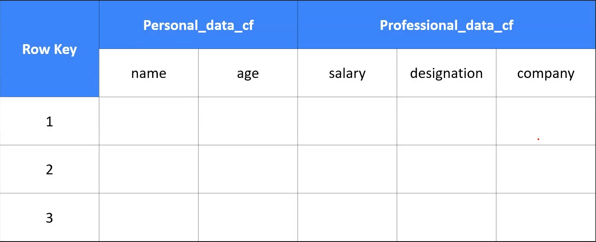

# Cloud BigTable

  

  - fully managed

  - wide column NoSQL database

  - not serverless (have to create an instance)

  - scale horizontally with multiple nodes

  - scale to huge volume of data

  - data stored column wise

  - columns are grouped into column families

  - milisecond latency

  - handles millions of requests per second

  - how to access
    * cbt - command line (part of cloud SDK)
    * Hbase API

  - no multi column index
    * only row key based indexing

  - design row key is very important

  - design row key by keeping in mind
    * which is your frequent query in the application
    * no hot spotting
    * dont use monotonically increasing key

  - seamless integration with
    * warehouse - BigQuery
    * Machine Learning Product

  - used for
    * financial data
    * time series data
