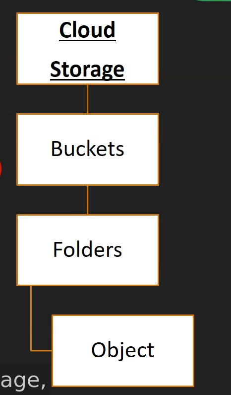

# Google Cloud Storage

  - object storage solution in GCP

  - Unstructured Data Storage
    * image
    * video
    * binary file, etc...

  - Cloud storage can be used for long term archival storage

  - Can be an access object over http, Rest API

  - No capacity planning required
    * Scale to Exabyte

  - Unlimited data can be stored

  - By default data is encrypted at rest

  - In transit also by default encryption.

## Characteristics

  - No minimun object size

  - max object size is 5 TB

  - High Durability - 99.999999999% annual

  - Object can be Globally accessed

  - Single API to access across multiple storage classes

  - Datais geo-redundant
    * it is Multiregional
    * dual-region storage (pairing storage to a region is also possible)

## Object organization

  - Global unique name for bucket

  - Example access URL:
    * https://storage.cloud.google.com/[bucket]/[objectname]

  - bucket name appear in url

  - cloud storage diagram:
  

  - cloud storage has folders in its interface, but it does not store anything like a file system
    * folders are virtual (all files in a bucket are stored in the same place)
