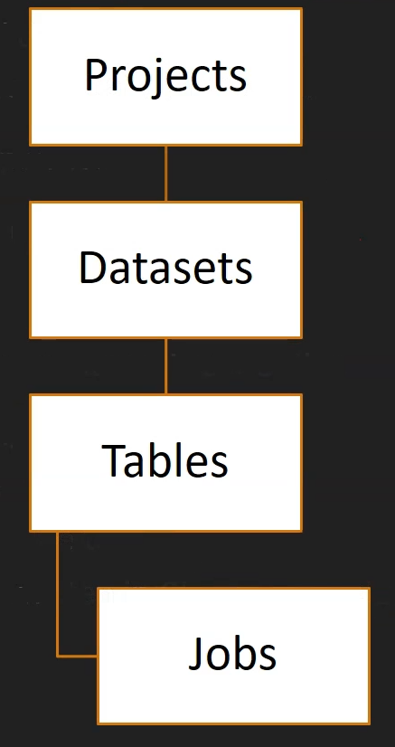

# Cloud BigQuery

  - data warehouse in GCP

  - Like a relational database - SQL schema

  - Serverless

  - Built using BigTable + GCP infraestructure

  - Bigquery is a columnar storage

  - Analytical database
    * not a transactional database

  - Exabyte scale

  - Query using
    * Standard SQL
    * Legacy SQL

  - BigQuery can query from external data sources like:
    * Cloud Storage, SQL, BigTable

  - BigQuery can load data from various sources
    * CSV, JSON, Avro, SQL and many more

  - Query is very expensive
    * $5 approx. for 1TB of data scanned

  - before query execution it does a dry run

  - alternative to OpenSource Apache Hive

  - How to access BigQuery
    * Cloud Console
    * bq - command line tool
    * Client library - written in C#, Python, Go, Java, Node.js, etc.

## BigQuery Data Organization

  

  - Projects are top level containers in GCP

  - Dataset holds multiple tables

  - each table must belong to a dataset

  - assign roles at the organization, project and dataset level

  - tables - contain data
    * it has a schema

  - types of tables:
    * native tables
    * external tables
    * views

  - jobs
    * manage asynchronous tasks
    * types of jobs: load, query, extract, copy

## When BigQuery should be used?

  - when workload is Analytical

  - when the data doesnt change in the database very often, as BigQuery uses built-in cache

  - for complex queries

  - when the query has a high execution time

  - when you want to off-load some workload from primary transaction DB, migrate the data to BigQuery

  - when the data volume is too high

  - no join is preferred
    * when your data is denormalized
