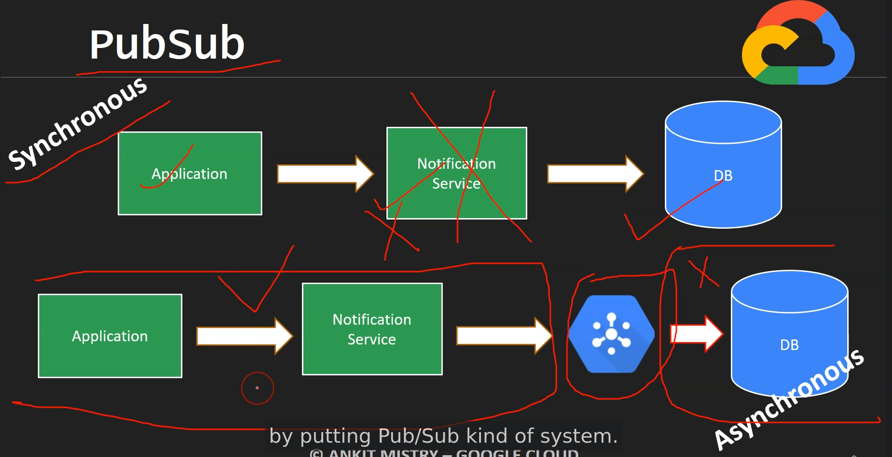

# PubSub

  

  - fully-managed asynchronous messaging service

  - scale to billions of messages per day

  - publisher - app send message to topic

  - push & pull way to access messages
    * pull - subscriber pull message
    * push - message will be sent to subscriber via webhook

  - one topic can have multiple subscribers as well as
    one subscriber can get messages from multiple topics

  

# Google Cloud PubSub

  - Fully-managed PubSub system inside Google Cloud

  - Serverless

  - Auto-Scaling and auto-provisioning with support from zero to hundreds of GB/second

  - Topic - Storage reference

  - Publisher send message to topic at pubsub.googleapis.com

  - Push - pull way to access message

  - One subscriber receives the message acknowledgment is sent back to pubsub

  - Cloud PubSub acts as a staging environment for many GCP services

## Advantages of using PubSub

  - Durability of data will increase

  - Highly scalable

  - decoupling between both systems (Publisher & Subscriber)
    * Application dont synchonously communicate with notification service
    * Application (Publisher) is not dependent on Notification service(Subscriber)
