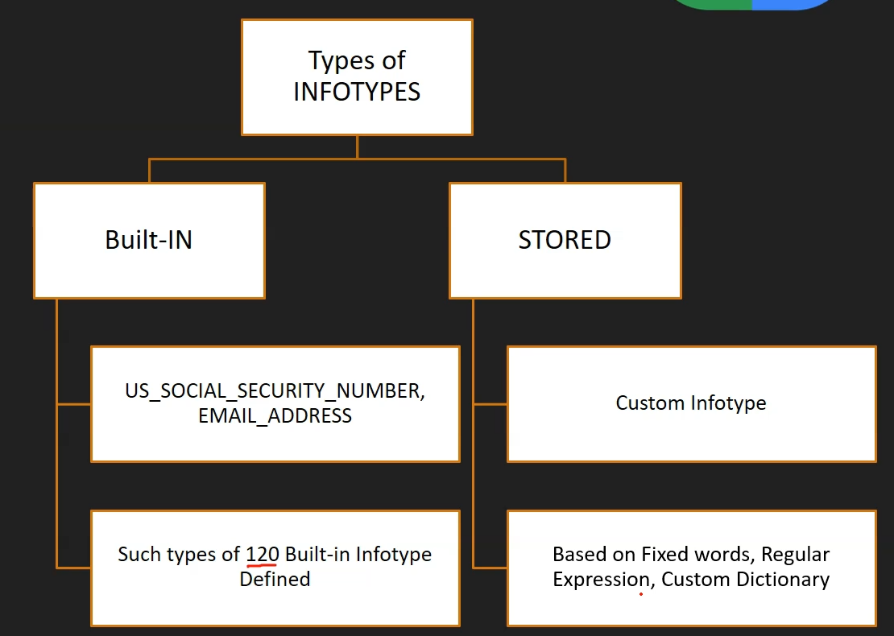

# Templates, InfoTypes and Match

## Templates

  - configuration which define for
    * inspection of jobs
    * de-identification of jobs

  - once the template is defined, it can be reused for other jobs

  

## InfoTypes

  - what to scan for
    * like credit card number
    * SSN
    * Age

  

## Match Likelihood

  
