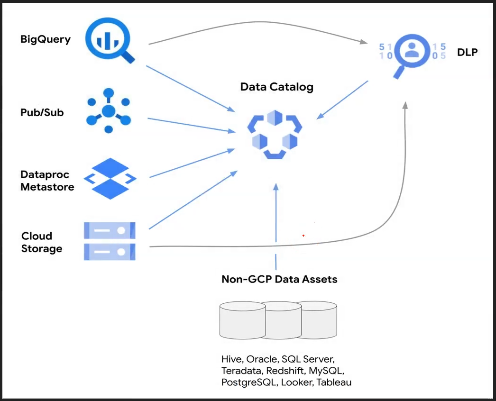

# Data Catalog

  - Most organizations today are dealing with a large and growing number of data assets

  - Data Stakeholders (consumers, producers and administrators) face a number of challenges:
    * searching for insightful data
    * understanding data
    * making data useful

## Data Catalog

  - fully managed and highly scalable data discovery and metadata management service

  - single place to discover all data assets across all the project

  - using data catalog
    * search data assets
    * tag data

  

## Metadata

  - Technical Metadata
    * for BigQuery and PubSub metadata resides inside individual products
    * Technical meta data is registered by catalog automatically

  - Business Metadata
    * Attach Tag to existing data asset
    * Define some Tag template and attach metadata
