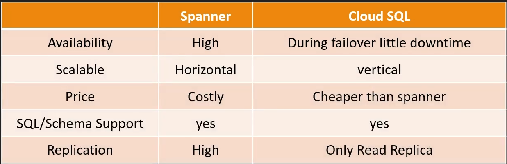

# Google Cloud Spanner

  - Spanner = Cloud SQL + Horizontal Scaling

  - distributed & scalable solution for RDBMS in GCP

  - Cloud native solution - specific to GCP
    * lift & shift is not possible, not recommended

  - fully managed, mission critial application

  - horizontal scalability

  - use when data volume > 2 TB

  - Costlier than Cloud SQL

  - Cloud SQL has just Read replicas
    * while Cloud Spanner has horizontal read/write
      across a region

  - highly scalable, petabyte scale

  - data is strongly typed
    * must define schema database
    * datatype for each column of each table must be defined

  - 99.999% availability

  - regional/ multi-region level instance can be created

  - data export
    * can not export with gcloud
    * Cloud Console or Cloud Dataflow Job

## Cloud Spanner vs Cloud SQL

  
