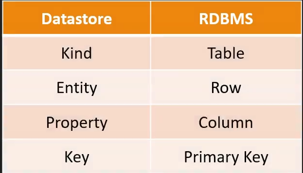

# DataStore

  - highly scalable NoSQL database

  - json-like data structure

  - serverless

  - document kind of data storage - MongoDB

  - App Engine + Datastore

  - Sql like Queries - GQL

  - support ACID transaction

  - multiple indexes

  - data replication across different regions

  - use case
    * session info
    * product catalog

  - export data from gcloud utility only

  
