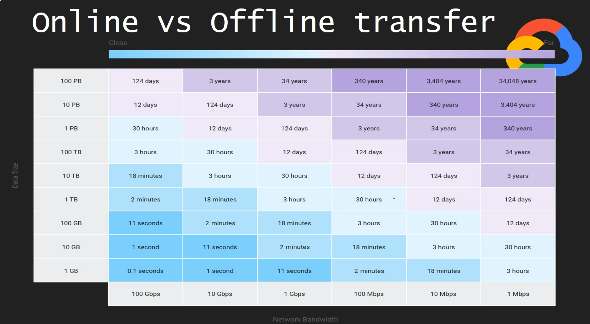

# Data Transder Services

  - from on-premises to Google Cloud Storage (GCS)

  - from One bucket to another bucket insider the same GCS

  - from other public cloud Amazon S3, Azure Container to GCS

# On-premises to (GCS)

## Online transfer

  - gsutil - command line utility
    * online mode of transfer
    * install locally Google Cloud SDK
    * gsutil -m cp large_number_of_small_files (-m for parallel upload)

  - Transfer job for on-premises data
    * this will quickly and securely move your data from private data centers
      into Google Cloud Storage
    * two step process
      - create an agent pool
      - create a transfer job on Google Cloud

  - Transfer job for cloud data
    * This will quickly and securely transfer data into GCS
    * From various sources
      - Amazon S3
      - Azure Blob Storage
      - Move data between Cloud Storage buckets
    * Create Transfer Job
    * Onetime run or recurring

## Offline Transfer

  - Transfer Appliance
    * Physical device which securely transfer large amounts of data to GOogle Cloud Platform
    * Useful when data that exceeds 20TB or would take more than a week to upload.

### Online vs Offline Transfer

  

  - when transfer time is too high given bandwidth and data size, you should consider a
    transfer appliance (offline transfer)
